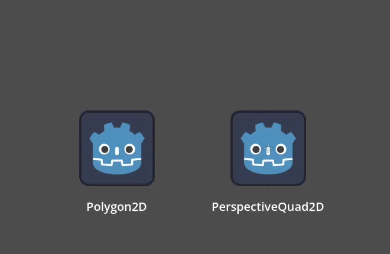
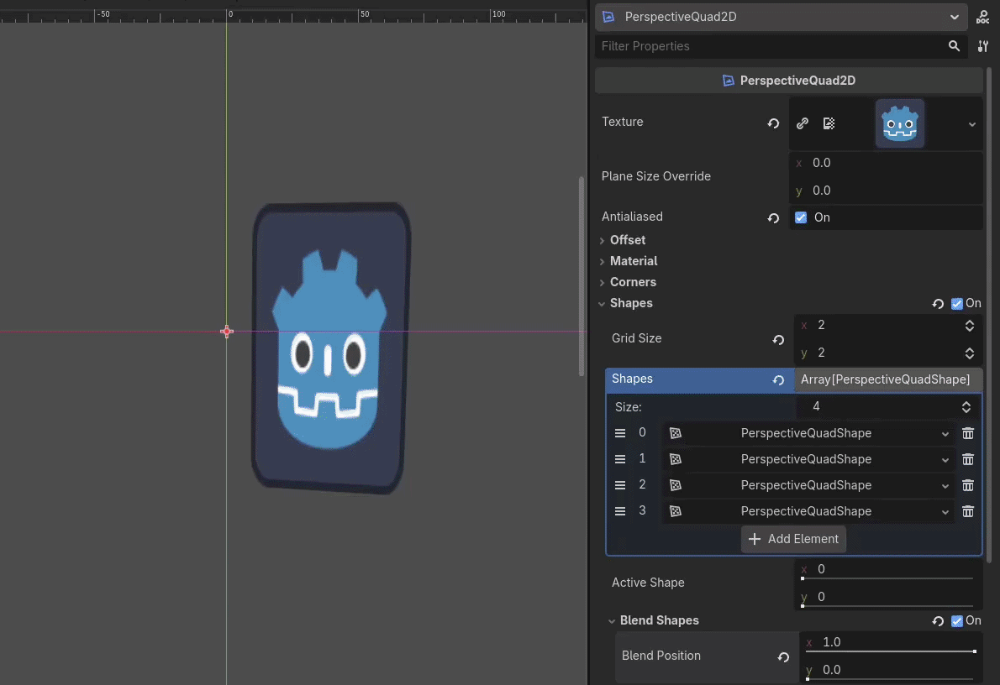
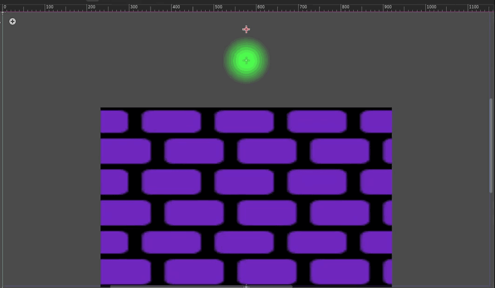
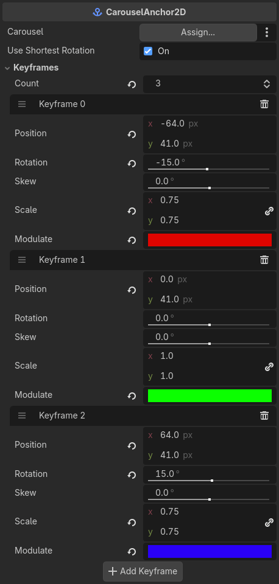
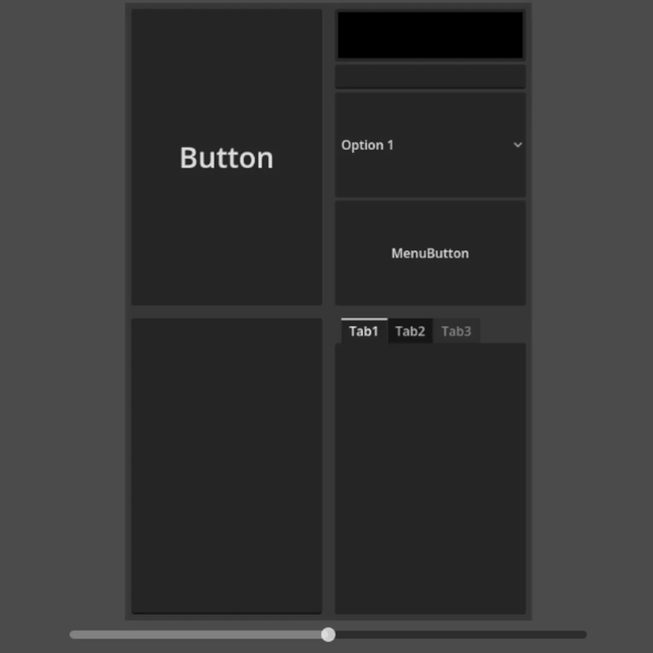

# Perspective Quads

 

This Godot addon implements four-point perspective warping for 2D sprites, with draggable corner handles, carousel drivers, and SubViewport input forwarding.

Whether you want a 2D piece of paper to convey depth, set up a scene in a point-and-click game with psuedo-3D elements, or utilize 2D perspective effects for some other reason, then this addon will probably be of use to you.

## Features
This addon adds in 4 new Node types and 1 new Resource type:
-  **PerspectiveQuad2D:** A specialized Node2D that draws a Texture2D through a four-point perspective warp, mapping the undistorted plane onto four arbitrary corner positions.

-  **PerspectiveQuadShape:** Resource that PerspectiveQuad2Ds can optionally use to blend between many different shapes and modulations.

-  **Carousel2D:** Exposes a single `view_position` and broadcasts it through `view_position_changed` to every subscriber. This can be used to drive the blending of PerspectiveQuad2Ds and CarouselAnchor2Ds to construct a 2D scene with psuedo-3D elements.

-  **CarouselAnchor2D:** Positions itself by interpolating keyframe transforms according to a Carousel2D's view position. Keyframes are editable directly in the inspector. This node can be used for transforming elements in a Carousel2D that aren't PerspectiveQuad2Ds.

-  **PerspectiveViewportContainer2D:** The PerspectiveQuad2D equivalent of SubViewportContainer. This displays a child SubViewport's texture through a perspective warp, and forwards input through it.

## Limitations:
- A PerspectiveQuad2D can only display properly when it's a convex shape. Anything concave will result in glitchy rendering. This isn't exactly a "limitation" as much as it's just kinda impossible for a perspective shape to be concave. Still, I thought this would be worth mentioning.
- PerspectiveQuad2Ds can only be selected from either the scene dock, or by clicking their origin gizmo. While workarounds have been attempted in this addon's development, all of them have been unstable and buggy. This functionality will be properly implemented whenever certain [editor](https://github.com/godotengine/godot-proposals/issues/5289) [selection](https://github.com/godotengine/godot-proposals/issues/8698) methods are properly exposed to GDScript.
- Custom materials for PerspectiveQuad2Ds need to utilize the `material_override` property, which is for unique ShaderMaterials utilizing a custom shader based off of the addon's [default shader](addons/perspective_quads/shaders/four_point_perspective_transform.gdshader). Directly setting `material` and `use_parent_material` is not supported.

## Credits:
- **BunkWire2X8:** The guy who made this addon and set up its repository.
- **Viiragon:** This addon uses a trimmed down version of their [shader code](https://godotshaders.com/shader/4-point-perspective-transformation/), with most of the important mathematical operations now being done outside of the shader.
  - Viiragon's shader code was adapted from this [blog post](https://naadispeaks.blog/2021/08/31/perspective-transformation-of-coordinate-points-on-polygons/) by **Haritha Thilakarathne**.
    - Haritha in turn also adapted his code from [a code snippet](https://math.stackexchange.com/questions/3037040/normalized-coordinate-of-point-on-4-sided-concave-polygon) by **Florian Segginger**.